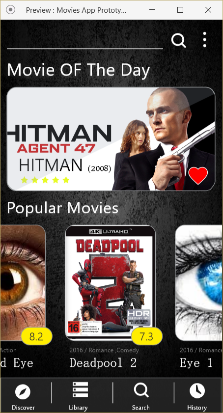
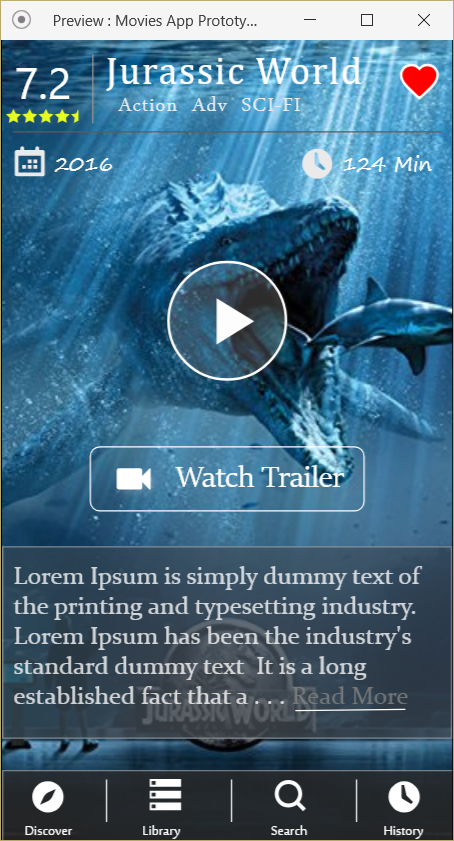

# ADNP2_Movies_App_Project_Stage2
This is a Movies App app, where the user can explores up to dated movies and its IMDB rating. alongside the description and the tralier for the movie.

Also, the user is able to search for any movie and he have the ability to add them into favourite movies to watch them later.

All of the movies were fetched from https://api.themoviedb.org/3/discover/movie API

 
